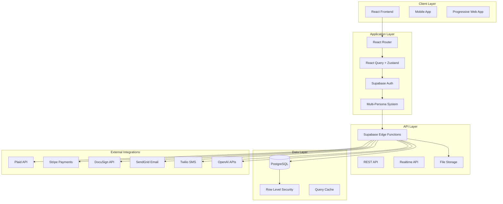
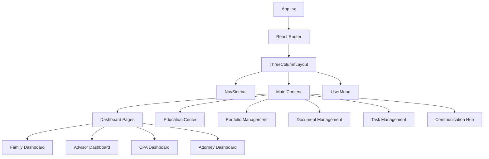
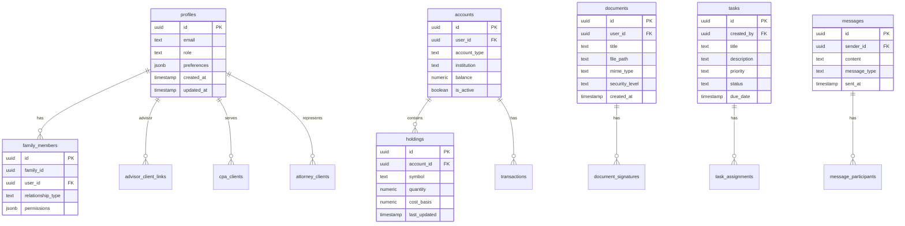
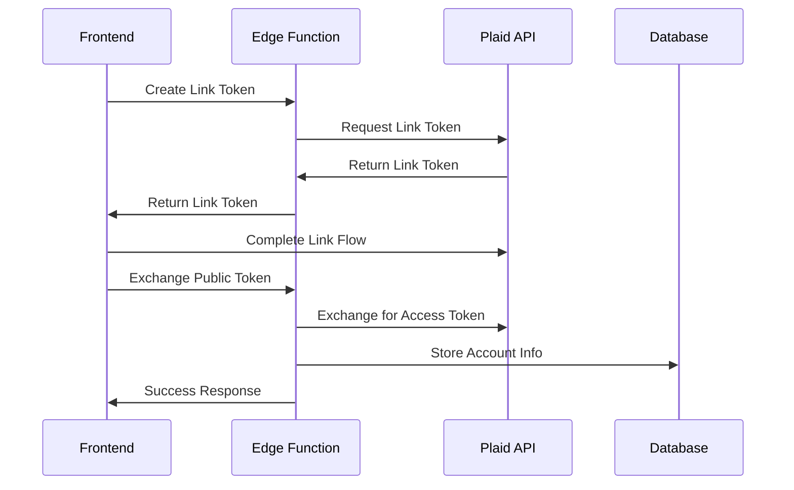
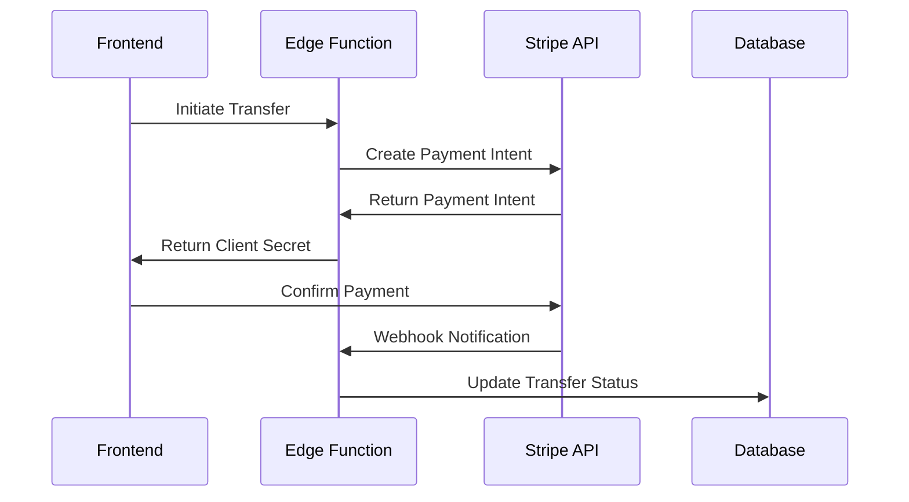
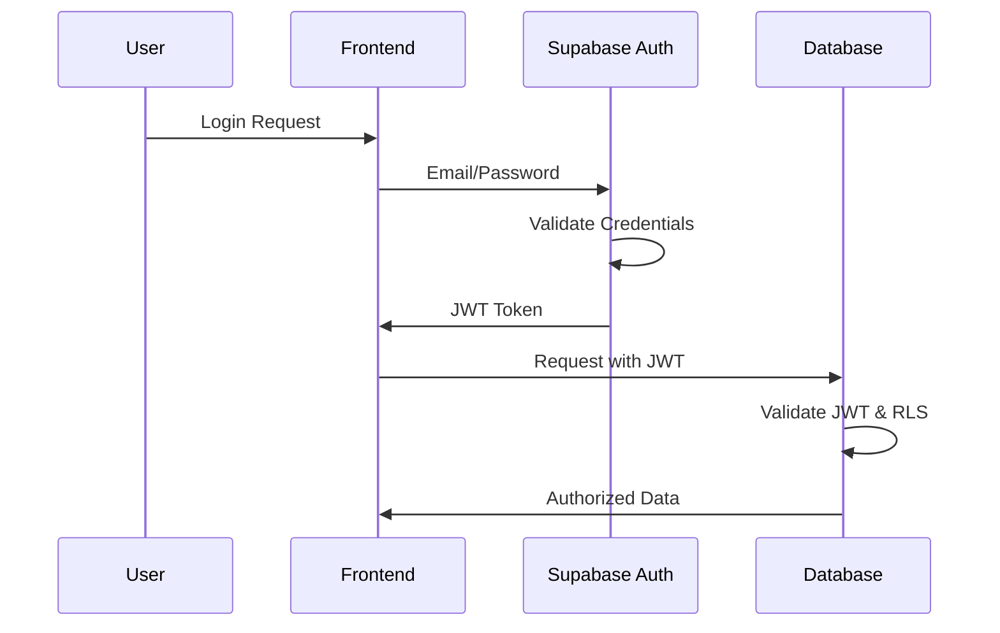
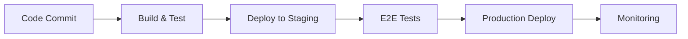

# My.BFOCFO Architecture Documentation

## System Overview

My.BFOCFO is a comprehensive Family Office Marketplace platform built as a multi-persona operating system that serves financial professionals, families, and advisory services through a unified interface.

## High-Level Architecture



## Frontend Architecture

### Component Hierarchy



### State Management Strategy

**React Query** for server state:
- Data fetching and caching
- Background refetching
- Optimistic updates
- Error handling and retries

**Zustand** for client state:
- UI state (sidebar open/closed, theme)
- User preferences
- Temporary form data
- Navigation state

**React Context** for:
- User authentication state
- Current persona/role
- Theme preferences

### Routing Strategy

```typescript
// Route Structure
/                         // Landing page
/education               // Public education center
/dashboard               // Role-based dashboard
/portfolio               // Portfolio management
/documents               // Document vault
/tasks                   // Task management
/messages                // Communication hub
/settings                // User settings
/admin                   // Admin interface (role-restricted)

// Dynamic Routes
/documents/:id           // Document viewer
/tasks/:id              // Task detail
/messages/:threadId     // Message thread
/portfolio/account/:id  // Account detail
```

## Backend Architecture

### Database Design



### Row-Level Security (RLS) Design

**Policy Patterns:**

1. **User Isolation**: Users can only access their own data
```sql
CREATE POLICY "Users can access own data" ON table_name
FOR ALL USING (user_id = auth.uid());
```

2. **Advisor Access**: Advisors can access their clients' data
```sql
CREATE POLICY "Advisors can access client data" ON table_name
FOR ALL USING (
  user_id IN (
    SELECT client_user_id FROM advisor_client_links 
    WHERE advisor_id = auth.uid()
  )
);
```

3. **Role-Based Access**: Different access levels by role
```sql
CREATE POLICY "Role-based access" ON table_name
FOR ALL USING (
  CASE 
    WHEN get_user_role() = 'admin' THEN true
    WHEN get_user_role() = 'advisor' THEN user_id IN (...)
    ELSE user_id = auth.uid()
  END
);
```

### Edge Functions Architecture

**Function Categories:**

1. **Public Functions** (no auth required):
   - `ai-analysis` - AI-powered analysis
   - `market-data` - Public market data
   - `leads-invite` - Lead generation
   - `events-track` - Analytics tracking

2. **Authenticated Functions**:
   - `plaid-*` - Banking integrations
   - `stripe-*` - Payment processing
   - `alternative-investments` - Alt investment management

3. **Webhook Functions**:
   - `stripe-ach-webhook` - Payment webhooks
   - `finnhub-webhook` - Market data webhooks

**Function Structure:**
```typescript
// Standard function pattern
import { serve } from "https://deno.land/std@0.168.0/http/server.ts"
import { createClient } from 'https://esm.sh/@supabase/supabase-js@2'

const corsHeaders = {
  'Access-Control-Allow-Origin': '*',
  'Access-Control-Allow-Headers': 'authorization, x-client-info, apikey, content-type',
}

serve(async (req) => {
  if (req.method === 'OPTIONS') {
    return new Response(null, { headers: corsHeaders });
  }

  try {
    const supabase = createClient(
      Deno.env.get('SUPABASE_URL') ?? '',
      Deno.env.get('SUPABASE_SERVICE_ROLE_KEY') ?? ''
    )

    // Function logic here

    return new Response(
      JSON.stringify(result),
      { headers: { ...corsHeaders, 'Content-Type': 'application/json' } }
    );
  } catch (error) {
    return new Response(
      JSON.stringify({ error: error.message }),
      { headers: { ...corsHeaders, 'Content-Type': 'application/json' }, status: 500 }
    );
  }
})
```

## Multi-Persona System

### Persona Types

1. **Family Member** - End users managing their wealth
2. **Financial Advisor** - Professional managing client portfolios
3. **CPA** - Tax professional handling client accounting
4. **Attorney** - Legal professional managing estate planning
5. **Admin** - System administrator with elevated access

### Permission Matrix

| Feature | Family | Advisor | CPA | Attorney | Admin |
|---------|--------|---------|-----|----------|-------|
| View own portfolio | ✅ | ✅ | ✅ | ✅ | ✅ |
| View client portfolios | ❌ | ✅ | ✅ | ✅ | ✅ |
| Edit portfolios | ✅ | ✅ | ❌ | ❌ | ✅ |
| Manage documents | ✅ | ✅ | ✅ | ✅ | ✅ |
| E-signature access | ✅ | ✅ | ✅ | ✅ | ✅ |
| Billing management | ❌ | ✅ | ✅ | ✅ | ✅ |
| User management | ❌ | ❌ | ❌ | ❌ | ✅ |
| System configuration | ❌ | ❌ | ❌ | ❌ | ✅ |

### Navigation Personalization

```typescript
// Dynamic navigation based on persona
const getNavigationItems = (userRole: string) => {
  const baseItems = [
    { name: 'Dashboard', href: '/dashboard', icon: Home },
    { name: 'Portfolio', href: '/portfolio', icon: TrendingUp },
    { name: 'Documents', href: '/documents', icon: FileText },
  ];

  const roleSpecificItems = {
    advisor: [
      { name: 'Clients', href: '/clients', icon: Users },
      { name: 'Lead Management', href: '/leads', icon: Target },
    ],
    cpa: [
      { name: 'Client Onboarding', href: '/cpa/onboarding', icon: UserPlus },
      { name: 'Tax Returns', href: '/cpa/returns', icon: Calculator },
    ],
    attorney: [
      { name: 'Client Matters', href: '/attorney/matters', icon: Scale },
      { name: 'Estate Planning', href: '/attorney/estate', icon: Crown },
    ],
    admin: [
      { name: 'User Management', href: '/admin/users', icon: Settings },
      { name: 'System Health', href: '/admin/health', icon: Activity },
    ],
  };

  return [...baseItems, ...(roleSpecificItems[userRole] || [])];
};
```

## Integration Architecture

### External API Integrations

**Plaid Integration** (Banking):


**Stripe Integration** (Payments):


### AI Service Integration

**OpenAI Integration**:
- Document analysis and parsing
- Financial planning recommendations
- Investment research summaries
- Risk assessment analysis

```typescript
// AI Analysis Service
const analyzeDocument = async (documentContent: string) => {
  const response = await openai.chat.completions.create({
    model: "gpt-4",
    messages: [
      {
        role: "system",
        content: "You are a financial document analysis expert..."
      },
      {
        role: "user",
        content: `Analyze this document: ${documentContent}`
      }
    ],
    temperature: 0.1,
  });

  return response.choices[0].message.content;
};
```

## Security Architecture

### Authentication Flow



### Data Protection Layers

1. **Transport Security**: HTTPS/TLS encryption
2. **Authentication**: JWT-based with secure sessions
3. **Authorization**: Row-Level Security policies
4. **Data Encryption**: At rest and in transit
5. **Audit Logging**: All operations logged
6. **Input Validation**: Zod schemas for all inputs

### File Security

```typescript
// Storage bucket policies
CREATE POLICY "Users can upload own files" ON storage.objects
FOR INSERT WITH CHECK (auth.uid()::text = (storage.foldername(name))[1]);

CREATE POLICY "Users can view own files" ON storage.objects
FOR SELECT USING (auth.uid()::text = (storage.foldername(name))[1]);
```

## Performance Optimization

### Caching Strategy

1. **React Query**: Server state caching with configurable TTL
2. **Browser Cache**: Static assets with proper cache headers
3. **Database**: Query result caching for expensive operations
4. **CDN**: Global distribution of static assets

### Code Splitting

```typescript
// Lazy loading for major sections
const Dashboard = lazy(() => import('./pages/Dashboard'));
const Portfolio = lazy(() => import('./pages/Portfolio'));
const Documents = lazy(() => import('./pages/Documents'));

// Route-based code splitting
<Route 
  path="/dashboard" 
  element={
    <Suspense fallback={<LoadingSpinner />}>
      <Dashboard />
    </Suspense>
  } 
/>
```

### Database Optimization

1. **Indexing**: Strategic indexes on frequently queried columns
2. **Query Optimization**: Efficient queries with proper joins
3. **Connection Pooling**: Managed by Supabase
4. **Read Replicas**: For read-heavy operations

## Monitoring & Observability

### Error Tracking

```typescript
// Error boundary implementation
class ErrorBoundary extends Component {
  componentDidCatch(error: Error, errorInfo: ErrorInfo) {
    // Log to external service
    logError(error, {
      userId: getCurrentUser()?.id,
      route: window.location.pathname,
      errorInfo,
    });
  }
}
```

### Performance Monitoring

1. **Core Web Vitals**: LCP, FID, CLS tracking
2. **Custom Metrics**: Feature usage, load times
3. **Database Performance**: Query execution times
4. **API Response Times**: External integration monitoring

### Health Checks

```typescript
// System health endpoint
const healthCheck = async () => {
  return {
    database: await checkDatabaseConnection(),
    externalAPIs: await checkExternalAPIs(),
    storage: await checkStorageAccess(),
    timestamp: new Date().toISOString(),
  };
};
```

## Deployment Architecture

### Current Setup

1. **Frontend**: Lovable platform with automatic deployments
2. **Backend**: Supabase hosted PostgreSQL + Edge Functions
3. **Storage**: Supabase storage with global CDN
4. **DNS**: Managed by hosting platform

### CI/CD Pipeline



### Environment Configuration

- **Development**: Local development with Supabase project
- **Staging**: Preview deployments for testing
- **Production**: Main branch deployment with monitoring

## Scalability Considerations

### Horizontal Scaling

1. **Database**: Managed by Supabase with read replicas
2. **Edge Functions**: Auto-scaling serverless functions
3. **Frontend**: CDN distribution for global reach
4. **Storage**: Object storage with automatic scaling

### Performance Bottlenecks

1. **Large Portfolio Queries**: Implement pagination and virtualization
2. **Document Processing**: Queue-based processing for large files
3. **Real-time Updates**: Optimize subscription queries
4. **Mobile Performance**: Reduce bundle size and optimize images

---

**Last Updated**: 2024-12-26
**Version**: 2.1.0
**Architect**: Development Team