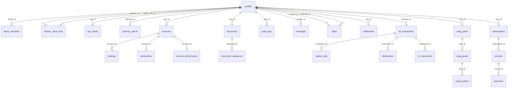

# Database Schema Documentation

## Overview

The My.BFOCFO platform uses PostgreSQL via Supabase with comprehensive Row-Level Security (RLS) policies. The schema supports multi-persona access patterns, ensuring data isolation while enabling appropriate cross-persona data sharing.

## Entity Relationship Diagram



## Core Tables

### Authentication & User Management

#### profiles
Extended user information beyond Supabase auth.users
```sql
CREATE TABLE public.profiles (
    id UUID PRIMARY KEY REFERENCES auth.users(id) ON DELETE CASCADE,
    email TEXT NOT NULL,
    role TEXT NOT NULL DEFAULT 'family',
    full_name TEXT,
    phone TEXT,
    avatar_url TEXT,
    preferences JSONB DEFAULT '{}',
    two_factor_enabled BOOLEAN DEFAULT false,
    tenant_id UUID,
    created_at TIMESTAMPTZ DEFAULT now(),
    updated_at TIMESTAMPTZ DEFAULT now()
);
```

**RLS Policies:**
- Users can view and update their own profile
- Advisors can view their clients' profiles
- Admins can view all profiles

#### family_members
Family office member relationships and hierarchies
```sql
CREATE TABLE public.family_members (
    id UUID PRIMARY KEY DEFAULT gen_random_uuid(),
    family_id UUID NOT NULL,
    user_id UUID REFERENCES public.profiles(id),
    relationship_type TEXT NOT NULL, -- 'patriarch', 'matriarch', 'child', 'spouse', 'other'
    permissions JSONB DEFAULT '{}',
    is_primary BOOLEAN DEFAULT false,
    created_at TIMESTAMPTZ DEFAULT now()
);
```

#### advisor_client_links
Advisor-client relationships with tier management
```sql
CREATE TABLE public.advisor_client_links (
    id UUID PRIMARY KEY DEFAULT gen_random_uuid(),
    advisor_id UUID NOT NULL REFERENCES public.profiles(id),
    client_user_id UUID NOT NULL REFERENCES public.profiles(id),
    relationship_type TEXT DEFAULT 'primary',
    client_tier TEXT DEFAULT 'basic',
    tier_billing_type TEXT DEFAULT 'advisor_covered',
    status TEXT DEFAULT 'active',
    created_at TIMESTAMPTZ DEFAULT now(),
    updated_at TIMESTAMPTZ DEFAULT now()
);
```

### Financial Data

#### accounts
Bank and investment accounts
```sql
CREATE TABLE public.accounts (
    id UUID PRIMARY KEY DEFAULT gen_random_uuid(),
    user_id UUID NOT NULL REFERENCES public.profiles(id),
    account_type TEXT NOT NULL, -- 'checking', 'savings', 'investment', 'retirement'
    institution TEXT NOT NULL,
    account_name TEXT NOT NULL,
    account_number_encrypted TEXT,
    routing_number_encrypted TEXT,
    balance NUMERIC(15,2) DEFAULT 0,
    currency TEXT DEFAULT 'USD',
    is_active BOOLEAN DEFAULT true,
    plaid_account_id TEXT,
    last_synced TIMESTAMPTZ,
    created_at TIMESTAMPTZ DEFAULT now(),
    updated_at TIMESTAMPTZ DEFAULT now()
);
```

**RLS Policies:**
- Users can access their own accounts
- Advisors can access their clients' accounts
- CPAs can access their clients' accounts (read-only)

#### holdings
Investment portfolio positions
```sql
CREATE TABLE public.holdings (
    id UUID PRIMARY KEY DEFAULT gen_random_uuid(),
    account_id UUID NOT NULL REFERENCES public.accounts(id),
    symbol TEXT NOT NULL,
    cusip TEXT,
    quantity NUMERIC(15,6) NOT NULL,
    cost_basis NUMERIC(15,2),
    current_price NUMERIC(15,2),
    market_value NUMERIC(15,2),
    asset_class TEXT, -- 'equity', 'bond', 'mutual_fund', 'etf', 'alternative'
    sector TEXT,
    last_updated TIMESTAMPTZ DEFAULT now(),
    created_at TIMESTAMPTZ DEFAULT now()
);
```

#### transactions
Financial transaction history
```sql
CREATE TABLE public.transactions (
    id UUID PRIMARY KEY DEFAULT gen_random_uuid(),
    account_id UUID NOT NULL REFERENCES public.accounts(id),
    transaction_type TEXT NOT NULL, -- 'buy', 'sell', 'dividend', 'transfer', 'fee'
    symbol TEXT,
    quantity NUMERIC(15,6),
    price NUMERIC(15,2),
    amount NUMERIC(15,2) NOT NULL,
    fee NUMERIC(15,2) DEFAULT 0,
    transaction_date DATE NOT NULL,
    settlement_date DATE,
    description TEXT,
    plaid_transaction_id TEXT,
    metadata JSONB DEFAULT '{}',
    created_at TIMESTAMPTZ DEFAULT now()
);
```

### Document Management

#### documents
Document metadata and storage references
```sql
CREATE TABLE public.documents (
    id UUID PRIMARY KEY DEFAULT gen_random_uuid(),
    user_id UUID NOT NULL REFERENCES public.profiles(id),
    title TEXT NOT NULL,
    description TEXT,
    file_path TEXT NOT NULL,
    file_size BIGINT,
    mime_type TEXT,
    document_type TEXT, -- 'tax_document', 'contract', 'statement', 'estate_plan'
    security_level TEXT DEFAULT 'private', -- 'public', 'private', 'confidential'
    tags TEXT[],
    metadata JSONB DEFAULT '{}',
    created_at TIMESTAMPTZ DEFAULT now(),
    updated_at TIMESTAMPTZ DEFAULT now()
);
```

#### document_signatures
E-signature tracking and status
```sql
CREATE TABLE public.document_signatures (
    id UUID PRIMARY KEY DEFAULT gen_random_uuid(),
    document_id UUID NOT NULL REFERENCES public.documents(id),
    signer_email TEXT NOT NULL,
    signer_name TEXT NOT NULL,
    signature_status TEXT DEFAULT 'pending', -- 'pending', 'signed', 'declined', 'expired'
    signature_date TIMESTAMPTZ,
    docusign_envelope_id TEXT,
    ip_address INET,
    signature_metadata JSONB DEFAULT '{}',
    created_at TIMESTAMPTZ DEFAULT now()
);
```

### Communication & Task Management

#### messages
Inter-user messaging system
```sql
CREATE TABLE public.messages (
    id UUID PRIMARY KEY DEFAULT gen_random_uuid(),
    sender_id UUID NOT NULL REFERENCES public.profiles(id),
    recipient_id UUID REFERENCES public.profiles(id),
    thread_id UUID,
    subject TEXT,
    content TEXT NOT NULL,
    message_type TEXT DEFAULT 'direct', -- 'direct', 'broadcast', 'system'
    is_read BOOLEAN DEFAULT false,
    read_at TIMESTAMPTZ,
    attachments JSONB DEFAULT '[]',
    sent_at TIMESTAMPTZ DEFAULT now()
);
```

#### tasks
Task management with assignment capabilities
```sql
CREATE TABLE public.tasks (
    id UUID PRIMARY KEY DEFAULT gen_random_uuid(),
    created_by UUID NOT NULL REFERENCES public.profiles(id),
    assigned_to UUID REFERENCES public.profiles(id),
    title TEXT NOT NULL,
    description TEXT,
    task_type TEXT, -- 'document_review', 'meeting_prep', 'compliance_check'
    priority TEXT DEFAULT 'medium', -- 'low', 'medium', 'high', 'urgent'
    status TEXT DEFAULT 'open', -- 'open', 'in_progress', 'completed', 'cancelled'
    due_date DATE,
    completed_at TIMESTAMPTZ,
    metadata JSONB DEFAULT '{}',
    created_at TIMESTAMPTZ DEFAULT now(),
    updated_at TIMESTAMPTZ DEFAULT now()
);
```

### Alternative Investments

#### alt_investments
Alternative investment tracking
```sql
CREATE TABLE public.alt_investments (
    id UUID PRIMARY KEY DEFAULT gen_random_uuid(),
    investor_id UUID NOT NULL REFERENCES public.profiles(id),
    investment_name TEXT NOT NULL,
    investment_type TEXT NOT NULL, -- 'private_equity', 'hedge_fund', 'real_estate', 'venture_capital'
    manager_name TEXT,
    vintage_year INTEGER,
    commitment_amount NUMERIC(15,2),
    called_amount NUMERIC(15,2) DEFAULT 0,
    distributed_amount NUMERIC(15,2) DEFAULT 0,
    nav NUMERIC(15,2),
    irr NUMERIC(5,2),
    status TEXT DEFAULT 'active', -- 'active', 'fully_called', 'liquidated'
    metadata JSONB DEFAULT '{}',
    created_at TIMESTAMPTZ DEFAULT now(),
    updated_at TIMESTAMPTZ DEFAULT now()
);
```

#### capital_calls
Capital call tracking for alternative investments
```sql
CREATE TABLE public.capital_calls (
    id UUID PRIMARY KEY DEFAULT gen_random_uuid(),
    investment_id UUID NOT NULL REFERENCES public.alt_investments(id),
    call_number INTEGER NOT NULL,
    call_amount NUMERIC(15,2) NOT NULL,
    due_date DATE NOT NULL,
    purpose TEXT,
    status TEXT DEFAULT 'pending', -- 'pending', 'funded', 'overdue'
    funded_date DATE,
    funded_amount NUMERIC(15,2),
    created_at TIMESTAMPTZ DEFAULT now()
);
```

#### distributions
Distribution tracking for alternative investments
```sql
CREATE TABLE public.distributions (
    id UUID PRIMARY KEY DEFAULT gen_random_uuid(),
    investment_id UUID NOT NULL REFERENCES public.alt_investments(id),
    distribution_date DATE NOT NULL,
    distribution_amount NUMERIC(15,2) NOT NULL,
    distribution_type TEXT, -- 'income', 'capital', 'return_of_capital'
    per_unit_amount NUMERIC(15,4),
    tax_character TEXT, -- 'ordinary_income', 'capital_gains', 'return_of_capital'
    payment_date DATE,
    metadata JSONB DEFAULT '{}',
    created_at TIMESTAMPTZ DEFAULT now()
);
```

### SWAG™ Planning System

#### swag_plans
Strategic Wealth Alpha GPS planning
```sql
CREATE TABLE public.swag_plans (
    id UUID PRIMARY KEY DEFAULT gen_random_uuid(),
    user_id UUID NOT NULL REFERENCES public.profiles(id),
    plan_name TEXT NOT NULL,
    plan_type TEXT DEFAULT 'comprehensive', -- 'basic', 'comprehensive', 'premium'
    time_horizon INTEGER, -- years
    risk_tolerance TEXT, -- 'conservative', 'moderate', 'aggressive'
    status TEXT DEFAULT 'draft', -- 'draft', 'active', 'completed', 'archived'
    created_at TIMESTAMPTZ DEFAULT now(),
    updated_at TIMESTAMPTZ DEFAULT now()
);
```

#### swag_goals
Individual goals within SWAG plans
```sql
CREATE TABLE public.swag_goals (
    id UUID PRIMARY KEY DEFAULT gen_random_uuid(),
    plan_id UUID NOT NULL REFERENCES public.swag_plans(id),
    goal_name TEXT NOT NULL,
    goal_type TEXT, -- 'retirement', 'education', 'major_purchase', 'legacy'
    target_amount NUMERIC(15,2),
    target_date DATE,
    priority INTEGER,
    current_value NUMERIC(15,2) DEFAULT 0,
    monthly_contribution NUMERIC(15,2),
    status TEXT DEFAULT 'active',
    created_at TIMESTAMPTZ DEFAULT now(),
    updated_at TIMESTAMPTZ DEFAULT now()
);
```

### Audit & Compliance

#### audit_logs
Comprehensive audit trail for all operations
```sql
CREATE TABLE public.audit_logs (
    id UUID PRIMARY KEY DEFAULT gen_random_uuid(),
    user_id UUID REFERENCES public.profiles(id),
    event_type TEXT NOT NULL, -- 'login', 'document_access', 'data_modification'
    table_name TEXT,
    record_id UUID,
    action TEXT, -- 'CREATE', 'READ', 'UPDATE', 'DELETE'
    old_values JSONB,
    new_values JSONB,
    ip_address INET,
    user_agent TEXT,
    session_id TEXT,
    timestamp TIMESTAMPTZ DEFAULT now()
);
```

**RLS Policies:**
- Audit logs are append-only
- Users cannot modify audit logs
- Admins can read all audit logs
- Users can read their own audit logs

## Row-Level Security (RLS) Policies

### Policy Patterns

#### 1. User Isolation Pattern
Most user data tables follow this pattern:
```sql
CREATE POLICY "users_own_data" ON table_name
    FOR ALL USING (user_id = auth.uid());
```

#### 2. Advisor Access Pattern
Advisors can access their clients' data:
```sql
CREATE POLICY "advisors_client_access" ON table_name
    FOR ALL USING (
        user_id = auth.uid() 
        OR user_id IN (
            SELECT client_user_id 
            FROM advisor_client_links 
            WHERE advisor_id = auth.uid() AND status = 'active'
        )
    );
```

#### 3. Professional Service Provider Pattern
CPAs and attorneys can access their clients' data:
```sql
CREATE POLICY "cpa_client_access" ON table_name
    FOR ALL USING (
        user_id = auth.uid()
        OR user_id IN (
            SELECT user_id 
            FROM cpa_clients 
            WHERE cpa_id = auth.uid() AND status = 'active'
        )
    );
```

#### 4. Family Access Pattern
Family members can access shared family data:
```sql
CREATE POLICY "family_shared_access" ON table_name
    FOR ALL USING (
        user_id = auth.uid()
        OR user_id IN (
            SELECT fm.user_id 
            FROM family_members fm1
            JOIN family_members fm2 ON fm1.family_id = fm2.family_id
            WHERE fm2.user_id = auth.uid()
        )
    );
```

#### 5. Role-Based Access Pattern
Different access levels based on user role:
```sql
CREATE POLICY "role_based_access" ON table_name
    FOR ALL USING (
        CASE 
            WHEN get_user_role() = 'admin' THEN true
            WHEN get_user_role() = 'advisor' THEN user_id IN (SELECT client_user_id FROM advisor_client_links WHERE advisor_id = auth.uid())
            ELSE user_id = auth.uid()
        END
    );
```

### Security Functions

#### get_user_role()
Returns the current user's role:
```sql
CREATE OR REPLACE FUNCTION get_user_role()
RETURNS TEXT AS $$
    SELECT role FROM public.profiles WHERE id = auth.uid();
$$ LANGUAGE SQL SECURITY DEFINER STABLE;
```

#### validate_user_role_access()
Validates if a user has access to a specific resource:
```sql
CREATE OR REPLACE FUNCTION validate_user_role_access(
    required_roles TEXT[],
    resource_type TEXT DEFAULT 'general',
    resource_id UUID DEFAULT NULL
) RETURNS BOOLEAN AS $$
DECLARE
    user_role TEXT;
    access_granted BOOLEAN := false;
BEGIN
    SELECT role INTO user_role FROM public.profiles WHERE id = auth.uid();
    
    IF user_role IS NULL THEN
        RETURN false;
    END IF;
    
    access_granted := user_role = ANY(required_roles);
    
    -- Log access attempt
    INSERT INTO public.security_audit_logs (
        user_id, event_type, severity, resource_type,
        action_performed, outcome, metadata
    ) VALUES (
        auth.uid(), 'role_access_check', 'low', resource_type,
        'role_validation',
        CASE WHEN access_granted THEN 'success' ELSE 'denied' END,
        jsonb_build_object(
            'required_roles', required_roles,
            'user_role', user_role,
            'resource_id', resource_id
        )
    );
    
    RETURN access_granted;
END;
$$ LANGUAGE plpgsql SECURITY DEFINER;
```

## Indexes for Performance

### Primary Indexes
```sql
-- User data access patterns
CREATE INDEX idx_profiles_role ON public.profiles(role);
CREATE INDEX idx_profiles_tenant_id ON public.profiles(tenant_id);

-- Financial data queries
CREATE INDEX idx_accounts_user_id ON public.accounts(user_id);
CREATE INDEX idx_holdings_account_id ON public.holdings(account_id);
CREATE INDEX idx_transactions_account_id_date ON public.transactions(account_id, transaction_date DESC);

-- Document access patterns
CREATE INDEX idx_documents_user_id ON public.documents(user_id);
CREATE INDEX idx_documents_type ON public.documents(document_type);

-- Audit and compliance
CREATE INDEX idx_audit_logs_user_id_timestamp ON public.audit_logs(user_id, timestamp DESC);
CREATE INDEX idx_audit_logs_event_type ON public.audit_logs(event_type);

-- Communication
CREATE INDEX idx_messages_recipient_id ON public.messages(recipient_id);
CREATE INDEX idx_messages_thread_id ON public.messages(thread_id);
CREATE INDEX idx_tasks_assigned_to ON public.tasks(assigned_to);
```

## Data Dictionary

### Common Column Types

| Column Pattern | Type | Description |
|----------------|------|-------------|
| `id` | UUID | Primary key using gen_random_uuid() |
| `user_id` | UUID | Foreign key to profiles table |
| `*_at` | TIMESTAMPTZ | Timestamp columns with timezone |
| `status` | TEXT | Enumerated status values |
| `metadata` | JSONB | Flexible additional data storage |
| `*_encrypted` | TEXT | Encrypted sensitive data |
| `amount` | NUMERIC(15,2) | Monetary amounts with 2 decimal places |
| `percentage` | NUMERIC(5,2) | Percentage values |

### Enumerated Values

#### User Roles
- `family` - Family office member
- `advisor` - Financial advisor
- `cpa` - Certified Public Accountant
- `attorney` - Legal counsel
- `admin` - System administrator

#### Account Types
- `checking` - Bank checking account
- `savings` - Bank savings account
- `investment` - Investment account
- `retirement` - Retirement account (401k, IRA, etc.)
- `alternative` - Alternative investments

#### Document Types
- `tax_document` - Tax-related documents
- `contract` - Legal contracts
- `statement` - Financial statements
- `estate_plan` - Estate planning documents
- `insurance` - Insurance policies

#### Security Levels
- `public` - Publicly accessible
- `private` - User and authorized parties only
- `confidential` - Restricted access with audit trail

## Migration Strategy

### Schema Versioning
Migrations are managed through Supabase CLI with the following patterns:

1. **Additive Changes**: New tables, columns, indexes
2. **Data Migrations**: Data transformation scripts
3. **Policy Updates**: RLS policy modifications
4. **Function Updates**: Database function changes

### Backup Strategy
- **Automated**: Daily full backups via Supabase
- **Point-in-time**: Transaction log backups for recovery
- **Testing**: Regular backup restoration testing

### Rollback Procedures
Each migration includes:
- Forward migration SQL
- Rollback migration SQL
- Data integrity checks
- Performance impact assessment

---

**Last Updated**: 2024-12-26
**Schema Version**: 2.1.0
**Database**: PostgreSQL 15+ via Supabase