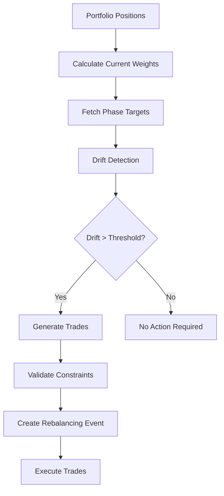
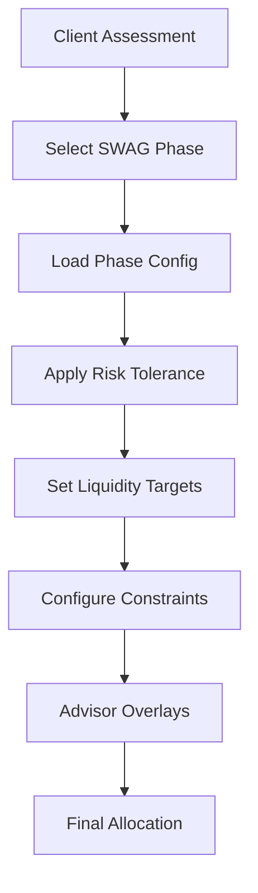
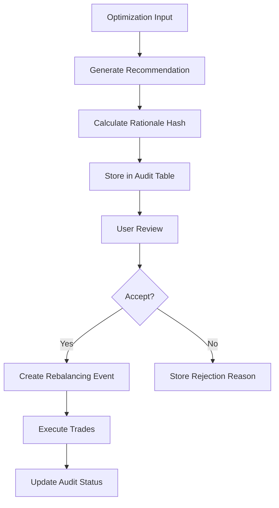

# Portfolio Risk Navigator GPS

## Overview

The Portfolio Risk Navigator GPS is a comprehensive portfolio optimization system that integrates SWAG (Something, Woo, Acceptance, Growth) phase policies with advanced risk management, drift detection, and intelligent rebalancing capabilities.

## Architecture

### Core Components

1. **Phase Policy Engine** (`src/engines/portfolio/phasePolicy.ts`)
   - Defines investment phases: Income Now, Income Later, Growth, Legacy
   - Configures risk tolerance, liquidity targets, and allocation constraints
   - Supports advisor constraint overlays

2. **LARB Calculator** (`src/engines/portfolio/larb.ts`)
   - Liquidity-Adjusted Risk Budget calculation
   - Market regime awareness (low, medium, high, extreme volatility)
   - Time horizon and client risk tolerance integration

3. **Utility Function** (`src/engines/portfolio/utility.ts`)
   - Fee-aware utility scoring: U = ER - λ1*Vol - λ2*MaxDD - λ3*Fees - λ4*LiquidityPenalty
   - Phase-specific penalty coefficients
   - Portfolio comparison and ranking

4. **Portfolio Optimizer** (`src/engines/portfolio/optimizer.ts`)
   - Drift detection and correction
   - Trade generation and execution planning
   - Constraint validation and compliance checking

5. **Market Regime Classifier** (`src/engines/portfolio/regime.ts`)
   - VIX-based volatility regime detection
   - Economic indicator integration
   - Risk adjustment recommendations

6. **PM3 Score Calculator** (`src/engines/portfolio/pm3.ts`)
   - Performance, Management, Methodology scoring
   - Fund evaluation and selection
   - Quantitative and qualitative factor analysis

7. **Monte Carlo Engine** (`src/engines/simulation/mcPac.ts`)
   - Portfolio stress testing and simulation
   - Value-at-Risk (VaR) and Conditional VaR calculation
   - Efficient frontier generation

### Database Schema

#### Core Tables

**portfolio_positions**
- Tracks current asset holdings
- Includes quantity, market value, cost basis
- User-scoped with RLS policies

**portfolio_targets**
- Defines target allocations by phase
- Supports multiple model versions
- Drift threshold configuration

**rebalancing_events**
- Audit trail for rebalancing actions
- Trade execution tracking
- Status and rationale logging

**recommendation_audit**
- Complete optimization history
- Input snapshots and results
- SHA-256 rationale hashing for integrity

**private_fund_holdings**
- Alternative investment tracking
- Capital calls and distributions
- Liquidity timeline management

**manager_signals**
- External manager recommendations
- Signal strength and confidence
- Time-decaying relevance

#### Security

All tables implement Row-Level Security (RLS) with:
- User-scoped access controls
- WITH CHECK constraints for data integrity
- Service role permissions for system operations

### Key Flows

#### 1. Drift & Execution Loop (DAE)



#### 2. Phase Policy Application (PPA)



#### 3. Recommendation Audit Chain (RAC)



## API Integration

### Edge Functions

**rebalance** (`supabase/functions/rebalance/index.ts`)
- Processes rebalancing requests
- Integrates with optimization engines
- Returns trade recommendations and rationale

### Client Integration

**usePortfolio Hook** (`src/hooks/usePortfolio.ts`)
- Centralized portfolio data management
- Optimization proposal generation
- Rebalancing ticket creation

## User Interface

### Key Components

**PortfolioPhaseSelector**
- Visual phase selection interface
- Risk tolerance and horizon display
- Phase comparison features

**OptimizationResults**
- Trade recommendation display
- Performance metrics visualization
- Risk assessment summary

**EnhancedPortfolioReviewGenerator**
- Main dashboard interface
- Optimization workflow management
- Analytics integration

## Analytics & Monitoring

### Event Tracking

- `optimization_run`: When users generate proposals
- `recommendation_viewed`: Report access tracking
- `rebalancing_ticket_created`: Execution requests
- `phase_policy_changed`: Configuration updates

### Performance Metrics

- Optimization success rates
- Trade execution efficiency
- Client satisfaction scores
- Risk-adjusted returns

## Testing Strategy

### Unit Tests
- Phase policy logic validation
- Drift detection accuracy
- Constraint enforcement
- Utility calculation verification

### Integration Tests
- Database RLS policy enforcement
- End-to-end optimization flow
- Edge function integration
- Error handling scenarios

### Compliance Testing
- Regulatory constraint validation
- Audit trail completeness
- Data integrity verification
- Security policy enforcement

## Configuration

### Environment Variables
All configuration is managed through database tables and Supabase configuration - no environment variables required.

### Phase Policies
Configurable through `SWAG_PHASE_CONFIGS` in `phasePolicy.ts`:
- Risk tolerance levels
- Liquidity requirements
- Allocation constraints
- Fee caps and thresholds

### Optimization Parameters
Adjustable through optimizer configuration:
- Drift thresholds
- Transaction costs
- Rebalancing frequency
- Constraint penalties

## Security Considerations

### Data Protection
- All user data encrypted at rest
- Row-level security enforced
- Audit trails for all operations
- Regular security assessments

### Access Control
- Role-based permissions
- Service role isolation
- API rate limiting
- Input validation and sanitization

### Compliance
- GDPR compliance for data handling
- SOC 2 Type II controls
- Regular penetration testing
- Incident response procedures

## Deployment

### Database Migrations
Use Supabase migration system:
```sql
supabase migration new portfolio_schema
supabase db push
```

### Edge Functions
Automatically deployed with code changes:
```bash
# Functions deploy automatically with Lovable
# No manual deployment required
```

### Monitoring
- Real-time error tracking
- Performance monitoring
- User analytics
- System health checks

## Roadmap

### Phase 1 (Current)
- ✅ Core optimization engine
- ✅ Database schema and RLS
- ✅ Basic UI components
- ✅ Phase policy integration

### Phase 2 (Next)
- [ ] Advanced Monte Carlo simulations
- [ ] Machine learning regime detection
- [ ] Real-time market data integration
- [ ] Mobile-responsive design

### Phase 3 (Future)
- [ ] AI-powered recommendation explanations
- [ ] Social trading features
- [ ] Advanced risk modeling
- [ ] Multi-currency support

## Support

For technical support or feature requests:
- Review test files for implementation examples
- Check analytics events for debugging
- Consult database schema documentation
- Monitor edge function logs for troubleshooting