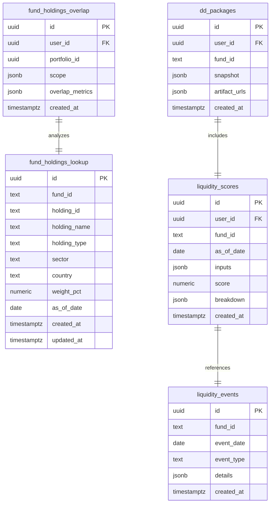
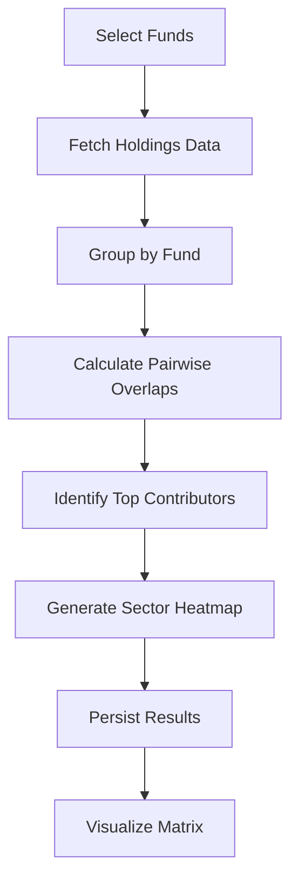
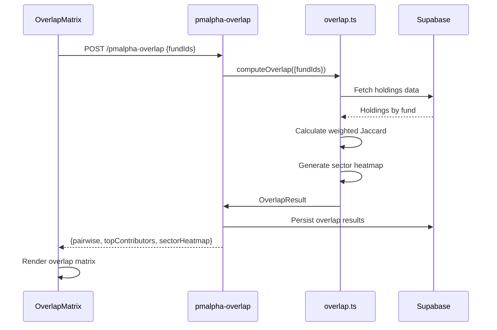
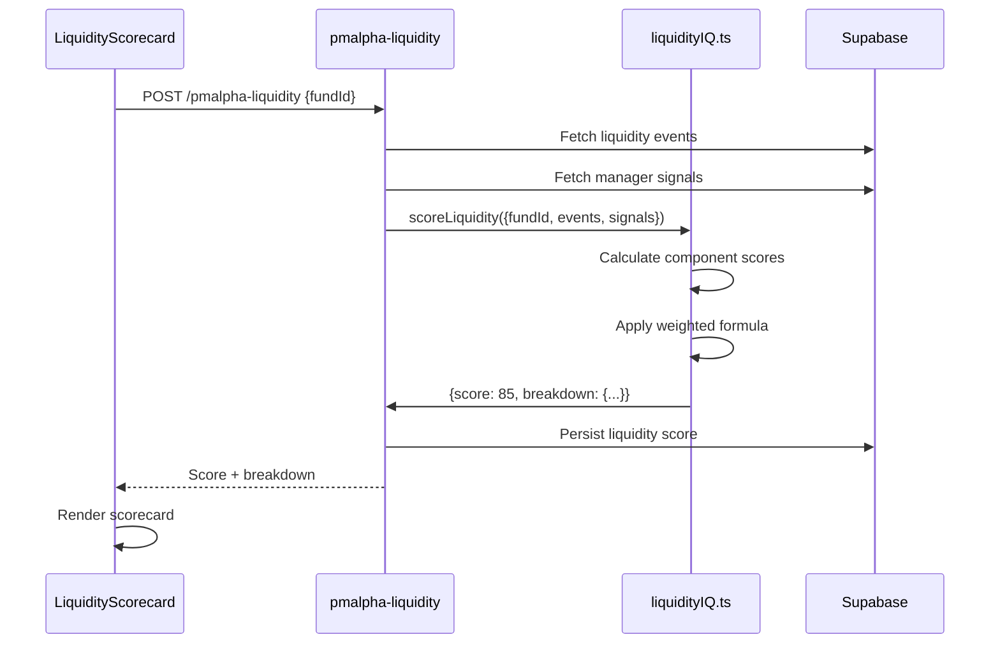
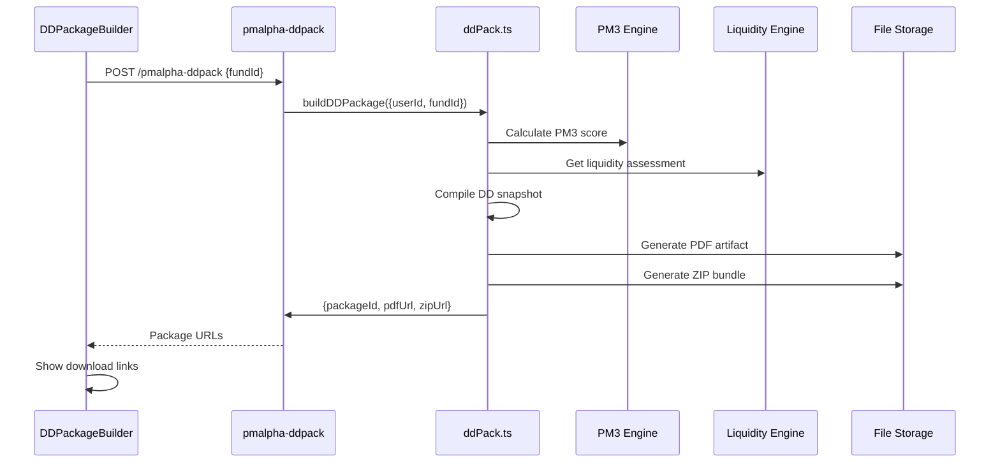

# Private Market Alpha Due Diligence & Liquidity Scoring System

## Overview

The Private Market Alpha system implements three core modules for comprehensive private fund analysis:

- **P5 Overlap Analysis Engine**: Cross-fund holdings concentration analysis
- **P7 Liquidity IQ™ Scoring**: Multi-factor liquidity assessment with predictive scoring
- **P6 DD Package Generator**: Automated compliance-ready due diligence bundle creation

## Architecture

### Database Schema



### System Components

#### 1. Overlap Analysis Engine (`src/engines/private/overlap.ts`)

**Purpose**: Detect portfolio concentration and manager overlap risks across private fund holdings.

**Key Functions**:
- `computeOverlap(input: OverlapInput): Promise<OverlapResult>`
- `persistOverlapResults(userId, portfolioId, scope, results)`

**Algorithm**: Weighted Jaccard similarity with sector concentration heatmaps.

**Workflow**:


#### 2. Liquidity IQ™ Scoring (`src/engines/private/liquidityIQ.ts`)

**Purpose**: Multi-factor liquidity risk assessment with 0-100 scoring.

**Scoring Components** (weighted):
- Gate Probability (35%): Historical gating events analysis
- NAV→Cash Timeline (25%): Redemption processing speed
- Fulfillment Rate (20%): Partial vs. full redemption success
- Penalty Structure (10%): Early redemption fees assessment
- Vintage Adjustment (5%): Fund age liquidity correlation
- AUM Trend Adjustment (5%): Assets under management flow impact

**Key Functions**:
- `scoreLiquidity(input: LiquidityScoreInput): Promise<LiquidityScoreResult>`
- `persistLiquidityScore(userId, fundId, inputs, result)`

#### 3. DD Package Generator (`src/engines/private/ddPack.ts`)

**Purpose**: Automated compliance-ready due diligence documentation generation.

**Package Contents**:
- PM3 Performance Score
- Liquidity IQ™ Assessment
- Risk Metrics & Analysis
- Compliance Verification
- Manager Information
- Document Inventory

**Key Functions**:
- `buildDDPackage(input: DDPackageInput): Promise<DDPackageResult>`
- `compileDDSnapshot(fundId): Promise<DDSnapshot>`

### Edge Functions

#### `/pmalpha-overlap`
- **Input**: `{ fundIds: string[], asOfDate?: string }`
- **Output**: Overlap matrix, top contributors, sector heatmap
- **Auth**: Required (user-specific)

#### `/pmalpha-liquidity`
- **Input**: `{ fundId: string, horizonDays?: number }`
- **Output**: 0-100 liquidity score with component breakdown
- **Auth**: Required (user-specific)

#### `/pmalpha-ddpack`
- **Input**: `{ fundId: string }`
- **Output**: PDF/ZIP URLs for DD package artifacts
- **Auth**: Required (user-specific)

### User Interface Components

#### 1. OverlapMatrix Component
```tsx
<OverlapMatrix fundIds={['FUND_A', 'FUND_B', 'FUND_C']} />
```
- Pairwise overlap visualization
- Top contributor identification
- Sector concentration heatmap
- Interactive matrix with color coding

#### 2. LiquidityScorecard Component
```tsx
<LiquidityScorecard fundId="FUND_A" />
```
- 0-100 Liquidity IQ™ score display
- Component breakdown with weights
- Recent event timeline
- Score history tracking

#### 3. DDPackageBuilder Component
```tsx
<DDPackageBuilder fundId="FUND_A" />
```
- One-click DD package generation
- Progress tracking with status updates
- Download links for PDF/ZIP artifacts
- Package history management

## Data Flow

### Overlap Analysis Flow


### Liquidity Scoring Flow


### DD Package Generation Flow


## Security & Compliance

### Row-Level Security (RLS)
- All private market tables enforce user isolation
- `auth.uid() = user_id` policies on all user-scoped tables
- Edge functions validate user authentication before processing

### Data Protection
- Sensitive fund data encrypted at rest
- Access logs for all DD package downloads
- Audit trails for overlap analysis requests

### Compliance Features
- Automated compliance checks in DD packages
- Regulatory document verification
- Manager credential validation
- Risk disclosure generation

## Performance Optimization

### Database Indexes
- `idx_fhl_fund_asof`: Fast holdings lookup by fund and date
- `idx_fho_user_created`: User overlap history retrieval
- `idx_liq_events_fund_date`: Efficient event querying
- `uq_liq_score_user_fund_asof`: Prevents duplicate scores

### Caching Strategy
- Overlap results cached for 24 hours
- Liquidity scores refreshed daily
- DD packages versioned with immutable URLs

### Query Optimization
- Materialized overlap results prevent real-time computation
- Liquidity events pre-aggregated by fund
- Bulk operations for multi-fund analysis

## Testing Strategy

### Unit Tests
- Overlap calculation accuracy verification
- Liquidity scoring component validation
- DD package content completeness

### Integration Tests
- End-to-end workflow testing
- Edge function authentication
- Database constraint validation

### Performance Tests
- Large fund set overlap analysis
- Concurrent user load testing
- Package generation stress testing

## Monitoring & Analytics

### Key Metrics
- Overlap analysis requests per user
- Average liquidity scores by fund vintage
- DD package generation success rate
- API response time distribution

### Error Handling
- Graceful degradation for missing data
- Retry logic for external data sources
- Comprehensive error logging

### Alerts
- Failed DD package generation
- Abnormal liquidity score patterns
- High overlap concentration warnings

## Future Enhancements

### Short-term
- Real-time liquidity event streaming
- Enhanced sector classification
- Multi-currency support

### Medium-term
- Machine learning overlap prediction
- Liquidity forecasting models
- Automated compliance reporting

### Long-term
- Blockchain-based audit trails
- AI-powered DD narrative generation
- Cross-asset class overlap analysis