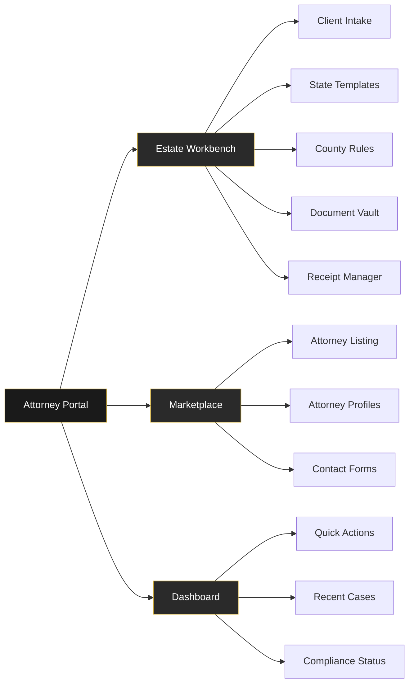

# Attorney UX Wireframes & Analysis

## Executive Summary
Analysis of Attorney persona routes and wireframe specifications for missing/incomplete pages to achieve production readiness.

**Current Status**: Limited attorney-specific routes exist, estate workbench needs creation, marketplace integration required.

## Attorney Route Analysis

### Existing Routes
- `/attorney/estate` - Basic estate planning stub ✅
- `/personas/attorneys` - Attorney persona dashboard ✅

### Missing Routes (Need Creation)
- `/marketplace/attorneys` - Attorney listing (404)
- `/marketplace/attorneys/:id` - Attorney profile (404)
- `/estate/workbench` - Estate planning workbench (404)
- `/attorneys/home` - Attorney dashboard (404)

## Wireframes

### 1. Estate Workbench (`/estate/workbench`)

```
┌─────────────────────────────────────────────────────────────────┐
│ [BrandHeader - Black bg, Gold accent]                           │
├─────────────────────────────────────────────────────────────────┤
│                                                                 │
│  ┌─────────────── bfo-card ─────────────────┐                  │
│  │ Estate Planning Workbench                 │                  │
│  │ Professional estate document preparation   │                  │
│  └───────────────────────────────────────────┘                  │
│                                                                 │
│  ┌─────────────── bfo-card ─────────────────┐                  │
│  │ Workflow Sections                         │                  │
│  │ ┌─────────┐ ┌─────────┐ ┌─────────┐      │                  │
│  │ │ Client  │ │ State   │ │ County  │      │                  │
│  │ │ Intake  │ │Template │ │ Cover   │      │                  │
│  │ │[Gold Btn│ │         │ │ Sheets  │      │                  │
│  │ └─────────┘ └─────────┘ └─────────┘      │                  │
│  │ ┌─────────┐ ┌─────────┐                  │                  │
│  │ │ Vault   │ │Receipt  │                  │                  │
│  │ │         │ │Manager  │                  │                  │
│  │ └─────────┘ └─────────┘                  │                  │
│  └───────────────────────────────────────────┘                  │
│                                                                 │
│  ┌─────────────── bfo-card ─────────────────┐                  │
│  │ Quick Actions                             │                  │
│  │ [Start Packet] [Validate Rules] [Export] │                  │
│  │ [Gold Button]  [Gold Outline] [Outline]  │                  │
│  └───────────────────────────────────────────┘                  │
│                                                                 │
└─────────────────────────────────────────────────────────────────┘
```

### 2. Attorney Marketplace (`/marketplace/attorneys`)

```
┌─────────────────────────────────────────────────────────────────┐
│ [BrandHeader]                                                   │
├─────────────────────────────────────────────────────────────────┤
│                                                                 │
│  ┌─────────────── bfo-card ─────────────────┐                  │
│  │ Find Expert Estate Planning Attorneys     │                  │
│  │ [Search Bar] [Gold Button - Search]      │                  │
│  └───────────────────────────────────────────┘                  │
│                                                                 │
│  ┌─────────────── bfo-card ─────────────────┐                  │
│  │ Specialization Filters                    │                  │
│  │ [Estate] [Probate] [Trust] [Tax Law]     │                  │
│  └───────────────────────────────────────────┘                  │
│                                                                 │
│  ┌─── Attorney Cards Grid ───┐                                  │
│  │ [Avatar] Jane Smith, Esq.  │                                  │
│  │ Estate Planning Attorney   │                                  │
│  │ ★ 4.8 | NY | 12+ years   │                                  │
│  │ [View Profile - Gold Btn] │                                  │
│  └───────────────────────────┘                                  │
│                                                                 │
└─────────────────────────────────────────────────────────────────┘
```

### 3. Attorney Profile (`/marketplace/attorneys/:id`)

```
┌─────────────────────────────────────────────────────────────────┐
│ [BrandHeader]                                                   │
├─────────────────────────────────────────────────────────────────┤
│                                                                 │
│  ┌─────────────── bfo-card ─────────────────┐                  │
│  │ [Avatar] Jane Smith, Esq.                 │                  │
│  │         Estate Planning Attorney          │                  │
│  │         New York, NY • 12+ years        │                  │
│  │         ⭐ 4.8 Rating | Bar: NY          │                  │
│  │                                           │                  │
│  │ Practice Areas: Estate, Probate, Trust   │                  │
│  └───────────────────────────────────────────┘                  │
│                                                                 │
│  ┌─────────────── bfo-card ─────────────────┐                  │
│  │ Contact Attorney                          │                  │
│  │ [ProInquiryForm - Attorney]              │                  │
│  │ Name: [________]   Email: [________]     │                  │
│  │ Legal Matter: [__________________]       │                  │
│  │ [Send Inquiry - Gold Button]            │                  │
│  └───────────────────────────────────────────┘                  │
│                                                                 │
└─────────────────────────────────────────────────────────────────┘
```

## Site Navigation Mermaid



## User Flow: Estate Document Preparation


## Critical Gaps & Fixes

### Missing Core Functionality
1. **Estate Workbench**: Primary attorney workflow tool
2. **Marketplace Integration**: Attorney discovery and contact
3. **Document Generation**: PDF export and template system
4. **County Rules Validation**: State-specific compliance checking

### Brand Consistency Issues
1. **Headers**: Need PersonaSubHeader with attorney-specific messaging
2. **Form Integration**: Contact forms need submitProInquiry integration
3. **Receipt System**: All actions need content-free RDS receipts
4. **Button Consistency**: Use GoldButton/GoldOutlineButton patterns

### Compliance Requirements
1. **Bar Association Info**: Display bar admissions and numbers
2. **Practice Area Validation**: Ensure accurate specialization display
3. **Professional Ethics**: Content-free receipts for all attorney actions
4. **Jurisdiction Limits**: Clear state/county practice limitations

## Action Items

| Priority | Component | Issue | Fix Required |
|----------|-----------|-------|--------------|
| P0 | /estate/workbench | 404 | Create full estate planning workbench |
| P0 | /marketplace/attorneys | 404 | Create attorney marketplace listing |
| P0 | /marketplace/attorneys/:id | 404 | Create attorney profile pages |
| P1 | ProInquiry integration | Missing | Wire contact forms to backend |
| P1 | Receipt system | Missing | Add RDS receipts for all actions |
| P2 | County rules validation | Stub | Implement state-specific rule checking |
| P3 | PDF generation | Missing | Document export functionality |

## Estate Workbench Sections Detail

### Client Intake
- Secure client information form
- Estate planning questionnaire
- Asset inventory checklist
- Beneficiary designation forms

### State Templates
- Will templates by state
- Trust document templates
- Power of attorney forms
- Healthcare directive forms

### County Cover Sheets
- Probate court filing requirements
- County-specific forms
- Fee schedules
- Filing deadlines

### Document Vault
- Secure document storage
- Version control system
- Client access portal
- Backup and recovery

### Receipt Manager
- All actions generate RDS receipts
- Content-free audit trail
- Client receipt delivery
- Professional compliance tracking

## Screenshots References
- Estate Workbench: Workflow-focused with clear action sections
- Attorney Marketplace: Professional credential display with ratings
- Profile Pages: Contact forms with practice area emphasis
- Document Generation: PDF preview with export options