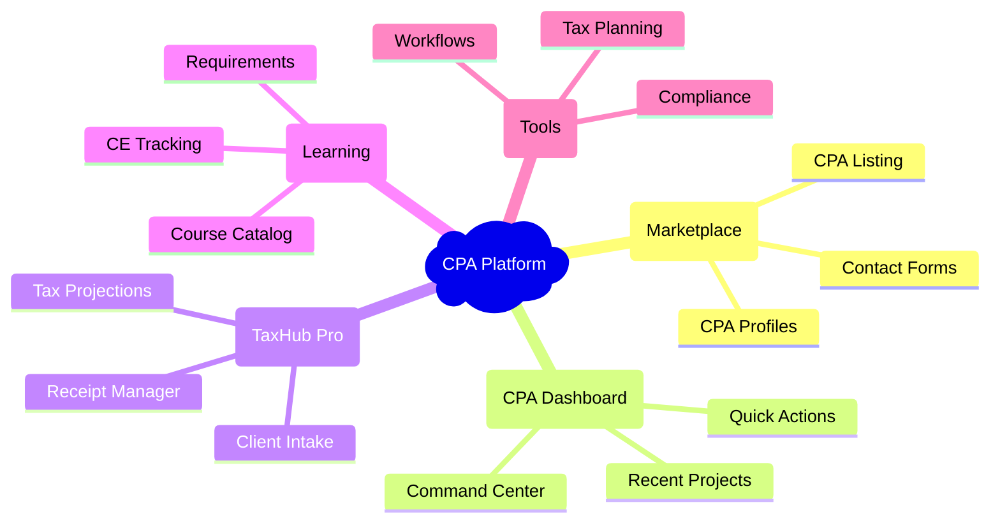

# CPA UX Wireframes & Analysis

## Executive Summary
Analysis of CPA persona routes and wireframe specifications for missing/incomplete pages to achieve production readiness.

**Current Status**: 3 CPA-specific routes exist, several 404s need stubs, inconsistent brand styling.

## CPA Route Analysis

### Existing Routes
- `/cpas/home` - CPA Home dashboard ✅ 
- `/marketplace/cpas` - CPA listing ✅
- `/marketplace/cpas/:id` - CPA profile ✅
- `/cpa/estate` - Estate planning tool ✅

### Missing Routes (Need Stubs)
- `/taxhub/pro` - Professional CPA console (404)
- `/cpa/tools` - CPA tools hub (404)  
- `/cpa/learn` - CE learning center (404)
- `/personas/cpa` - CPA persona dashboard (404)

## Wireframes

### 1. CPA Home Dashboard (`/cpas/home`)

```
┌─────────────────────────────────────────────────────────────────┐
│ [BFO Header - Black bg, Gold accent]                           │
├─────────────────────────────────────────────────────────────────┤
│ [PersonaSubHeader - Black bg, Gold "CPA Dashboard"]            │
├─────────────────────────────────────────────────────────────────┤
│                                                                 │
│  ┌─────────────── bfo-card ─────────────────┐                  │
│  │ CPA Command Center                        │                  │
│  │ ┌─────────┐ ┌─────────┐ ┌─────────┐      │                  │
│  │ │Tax Proj │ │Client   │ │CE Center│      │                  │
│  │ │ Gold Btn│ │Portal   │ │         │      │                  │
│  │ └─────────┘ └─────────┘ └─────────┘      │                  │
│  └───────────────────────────────────────────┘                  │
│                                                                 │
│  ┌─────────────── bfo-card ─────────────────┐                  │
│  │ Quick Actions                             │                  │
│  │ [📊] [📁] [🎓] [📋]                      │                  │
│  │ Start  Client  CE Req  Compliance        │                  │
│  │ Proj   Docs                              │                  │
│  └───────────────────────────────────────────┘                  │
│                                                                 │
└─────────────────────────────────────────────────────────────────┘
```

**Current Issues:**
- Uses basic Button vs GoldButton for CTAs
- Missing proper semantic structure
- No integration with TaxHub Pro console

### 2. TaxHub Pro Console (`/taxhub/pro`) - **NEEDS CREATION**

```
┌─────────────────────────────────────────────────────────────────┐
│ [BrandHeader]                                                   │
├─────────────────────────────────────────────────────────────────┤
│                                                                 │
│  ┌─────────────── bfo-card ─────────────────┐                  │
│  │ TaxHub Pro - CPA Console                  │                  │
│  │                                           │                  │
│  │ ┌─────────┐ ┌─────────┐ ┌─────────┐      │                  │
│  │ │ Client  │ │ Tax     │ │ Receipt │      │                  │
│  │ │ Intake  │ │ Project │ │ Manager │      │                  │
│  │ │[Gold Btn│ │ ions    │ │         │      │                  │
│  │ └─────────┘ └─────────┘ └─────────┘      │                  │
│  └───────────────────────────────────────────┘                  │
│                                                                 │
│  ┌─────────────── bfo-card ─────────────────┐                  │
│  │ Recent Projects                           │                  │
│  │ ┌─────────────────────────────────────┐   │                  │
│  │ │ Smith Family 2024 | Status: Review │   │                  │
│  │ │ Jones LLC Filing  | Status: Draft  │   │                  │
│  │ └─────────────────────────────────────┘   │                  │
│  └───────────────────────────────────────────┘                  │
│                                                                 │
└─────────────────────────────────────────────────────────────────┘
```

### 3. CPA Profile (`/marketplace/cpas/:id`)

```
┌─────────────────────────────────────────────────────────────────┐
│ [BrandHeader]                                                   │
├─────────────────────────────────────────────────────────────────┤
│                                                                 │
│  ┌─────────────── bfo-card ─────────────────┐                  │
│  │ [Avatar] Sarah Johnson, CPA               │                  │
│  │         Tax Planning & Estate Tax         │                  │
│  │         New York, NY • 15+ years        │                  │
│  │         ⭐ 4.9 Rating                     │                  │
│  │                                           │                  │
│  │ 15+ Years | 500+ Clients | $50M+ Savings │                  │
│  └───────────────────────────────────────────┘                  │
│                                                                 │
│  ┌─────────────── bfo-card ─────────────────┐                  │
│  │ Contact Sarah                             │                  │
│  │ [ProInquiryForm]                         │                  │
│  │ Name: [________]   Email: [________]     │                  │
│  │ Message: [___________________]           │                  │
│  │ [Send Inquiry - Gold Button]            │                  │
│  └───────────────────────────────────────────┘                  │
│                                                                 │
└─────────────────────────────────────────────────────────────────┘
```

### 4. CPA Learning Center (`/cpa/learn`) - **NEEDS CREATION**

```
┌─────────────────────────────────────────────────────────────────┐
│ [BrandHeader]                                                   │
├─────────────────────────────────────────────────────────────────┤
│                                                                 │
│  ┌─────────────── bfo-card ─────────────────┐                  │
│  │ Continuing Education Center               │                  │
│  │ Track CE requirements and access          │                  │
│  │ professional development                  │                  │
│  └───────────────────────────────────────────┘                  │
│                                                                 │
│  ┌─────────────── bfo-card ─────────────────┐                  │
│  │ CE Progress                               │                  │
│  │ Total Hours: [■■■■■░░] 24/40             │                  │
│  │ Ethics Hours: [■■░░] 2/4                 │                  │
│  │ [View Full Report - Gold Outline]        │                  │
│  └───────────────────────────────────────────┘                  │
│                                                                 │
│  ┌─────────────── bfo-card ─────────────────┐                  │
│  │ Featured Courses                          │                  │
│  │ Tax Update 2024 (8 hrs) [Enroll]        │                  │
│  │ Ethics in Practice (4 hrs) [Enroll]     │                  │
│  └───────────────────────────────────────────┘                  │
│                                                                 │
└─────────────────────────────────────────────────────────────────┘
```

## Site Navigation Mermaid



## User Flow: CPA Client Intake


## Critical Gaps & Fixes

### Brand Consistency Issues
1. **Headers**: Some pages missing PersonaSubHeader with black/gold styling
2. **Cards**: Inconsistent use of bfo-card class
3. **Buttons**: Missing GoldButton/GoldOutlineButton usage
4. **Typography**: H1 not always using proper semantic structure

### Missing Functionality
1. **TaxHub Pro Console**: Core professional workflow missing
2. **CE Integration**: Learning management system needed
3. **Receipt System**: Professional-grade receipt generation
4. **Client Portal**: Direct client communication interface

### SEO/Accessibility
1. **Title tags**: Missing on several CPA pages
2. **Meta descriptions**: Not optimized for CPA searches
3. **H1 structure**: Inconsistent hierarchy
4. **Form labels**: Missing proper accessibility attributes

## Action Items

| Priority | Component | Issue | Fix Required |
|----------|-----------|-------|--------------|
| P0 | /taxhub/pro | 404 | Create full console page |
| P0 | /cpa/tools | 404 | Create tools hub stub |
| P0 | /cpa/learn | 404 | Create CE learning center |
| P1 | CpaHome | Brand inconsistency | Update to use GoldButton |
| P1 | CpaProfile | Missing form integration | Wire ProInquiryForm |
| P2 | All CPA pages | SEO optimization | Add proper meta tags |
| P3 | Mobile responsiveness | Layout issues | Test and fix responsive design |

## Screenshots References
- CPA Dashboard: Clean, professional layout with quick actions
- TaxHub Console: Workflow-focused with client project management
- Learning Center: Progress tracking with course enrollment
- Profile Pages: Contact forms with professional credentials display