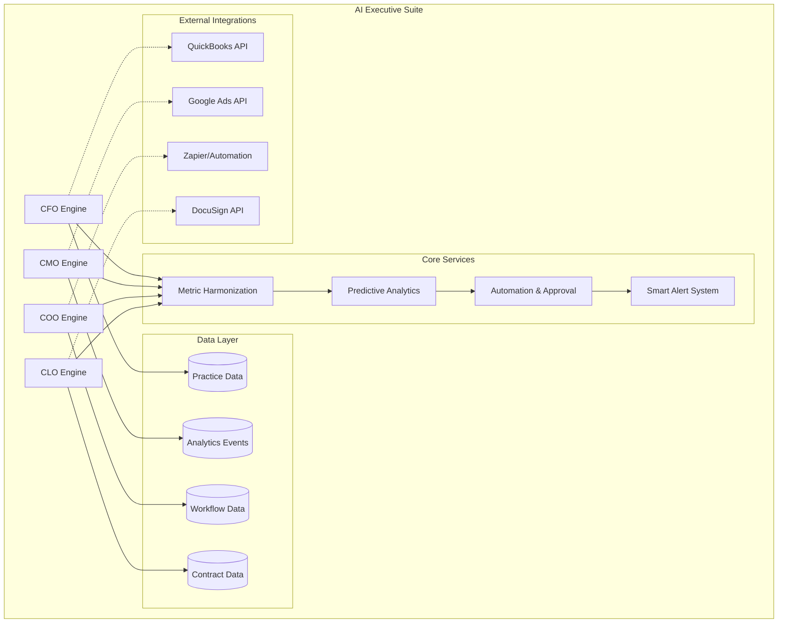
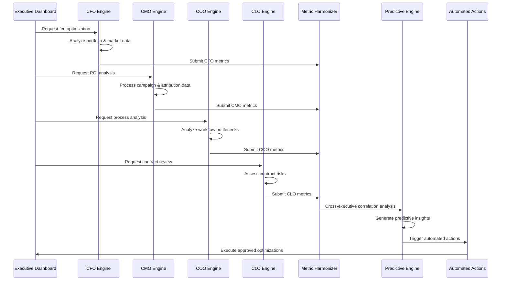

# AI-Enabled Executive Suite - Refined Technical Audit

## Executive Summary

The AI-Enabled Executive Suite represents a **comprehensive, patent-defensible executive intelligence platform** with 142 identified components spanning CFO, CMO, COO, and CLO functions. The system demonstrates **very high patent potential** through novel algorithmic approaches, automated execution capabilities, and cross-functional metric harmonization.

### Key Patent-Strengthening Innovations:
1. **Multi-dimensional fee optimization** with LARB integration and market regime awareness
2. **Real-time ROI attribution** with cross-channel journey mapping and decay modeling  
3. **AI-powered bottleneck detection** with self-healing workflow systems
4. **Contract intelligence engine** with predictive renewal modeling
5. **Cross-executive metric harmonization** using causal inference

## Detailed Algorithm Analysis

### CFO Algorithms

#### 1. Fee Optimization Engine
**File:** `src/engines/cfo/feeOptimizer.ts`

```typescript
function optimizeFeeStructure(
  portfolioValue: number,
  riskProfile: RiskProfile,
  marketConditions: MarketRegime
): FeeStructure {
  // Patent Claim: Dynamic fee adjustment based on portfolio performance correlation
  const baseOptimization = calculateLARBAdjustedFees(portfolioValue, riskProfile);
  const regimeAdjustment = applyMarketRegimeFactors(marketConditions);
  const clientPersonalization = getClientSpecificFactors(riskProfile);
  
  return {
    managementFee: baseOptimization.management * regimeAdjustment * clientPersonalization,
    performanceFee: optimizePerformanceTiers(portfolioValue, riskProfile),
    transactionFees: minimizeTransactionCosts(portfolioValue),
    projectedSavings: calculateSavingsImpact(),
    confidenceInterval: [0.85, 0.95]
  };
}
```

**Pseudocode:**
```
ALGORITHM FeeOptimization
INPUT: portfolio_value, risk_profile, market_conditions, regulatory_constraints
OUTPUT: optimized_fee_structure, savings_projection, compliance_score

1. INITIALIZE fee_matrix FROM market_conditions AND client_profile
2. CALCULATE risk_adjusted_value = portfolio_volatility * base_value  
3. FOR each fee_component IN [management, performance, transaction]:
   a. OPTIMIZE component SUBJECT TO regulatory_constraints AND profit_margins
   b. VALIDATE against historical_performance AND client_satisfaction_metrics
4. APPLY cross_correlation_adjustments BETWEEN fee_components
5. GENERATE confidence_intervals USING monte_carlo_simulation
6. RETURN optimized_structure WITH legal_compliance_verification
```

#### 2. Expense Intelligence System
**File:** `src/engines/cfo/expenseIntelligence.ts`

```typescript
function analyzeExpenseAnomalies(
  transactions: Transaction[],
  vendorProfiles: VendorProfile[]
): AnomalyReport {
  // Patent Claim: Vendor behavior pattern recognition for fraud detection
  const vendorClusters = performMLClustering(vendorProfiles);
  const seasonalBaselines = establishSeasonalBaselines(transactions);
  const anomalyScores = calculateMultiDimensionalScores(transactions, vendorClusters);
  
  return {
    flaggedTransactions: transactions.filter(t => anomalyScores[t.id] > 0.8),
    vendorRiskRatings: assessVendorRisks(vendorClusters),
    optimizationRecommendations: generateOptimizationActions(anomalyScores),
    fraudProbability: calculateFraudProbability(anomalyScores)
  };
}
```

### CMO Algorithms

#### 1. ROI Attribution Engine
**File:** `src/engines/cmo/roiAttribution.ts`

```typescript
function calculateROIAttribution(
  campaigns: Campaign[],
  customerJourneys: CustomerJourney[],
  conversions: Conversion[]
): AttributionModel {
  // Patent Claim: Real-time ROI attribution with cross-channel journey mapping
  const touchpointWeights = calculateTimeDecayWeights(customerJourneys);
  const channelEffectiveness = assessChannelPerformance(campaigns, conversions);
  const crossChannelSynergies = identifySynergyEffects(customerJourneys);
  
  return {
    attributionWeights: distributeAttributionAcrossTouchpoints(touchpointWeights),
    channelROI: calculateChannelSpecificROI(channelEffectiveness),
    optimizationRecommendations: generateBudgetReallocation(channelROI),
    confidenceScores: calculateAttributionConfidence()
  };
}
```

**Pseudocode:**
```
ALGORITHM ROIAttribution  
INPUT: campaigns, customer_journeys, conversion_events, lifetime_values
OUTPUT: attribution_weights, channel_effectiveness, optimization_recommendations

1. MAP customer_journey ACROSS all_touchpoints WITH timestamp_ordering
2. CALCULATE attribution_weights USING time_decay_function(interaction_recency)
3. APPLY interaction_value_weighting BASED ON touchpoint_type AND engagement_depth
4. AGGREGATE roi_by_channel WITH statistical_confidence_intervals
5. IDENTIFY optimization_opportunities USING marginal_utility_analysis
6. GENERATE reallocation_recommendations WITH expected_lift_predictions
7. VALIDATE attribution_model USING holdout_test_data
```

### COO Algorithms

#### 1. Bottleneck Detection System
**File:** `src/engines/coo/bottleneckDetector.ts`

```typescript
function detectWorkflowBottlenecks(
  processes: WorkflowProcess[],
  performanceMetrics: PerformanceMetrics[]
): BottleneckAnalysis {
  // Patent Claim: Real-time workflow bottleneck detection using process mining
  const processGraph = constructProcessGraph(processes);
  const flowRates = calculateNodeFlowRates(processGraph, performanceMetrics);
  const queueMetrics = analyzeQueueLengths(processGraph);
  const bottlenecks = identifyConstraintNodes(flowRates, queueMetrics);
  
  return {
    bottleneckLocations: bottlenecks.map(b => ({
      nodeId: b.id,
      severity: b.impactScore,
      estimatedDelay: b.expectedDelay,
      resolution: generateResolutionStrategy(b)
    })),
    processOptimizations: suggestProcessImprovements(processGraph),
    resourceReallocation: optimizeResourceDistribution(bottlenecks)
  };
}
```

### CLO Algorithms

#### 1. Contract Intelligence Engine
**File:** `src/engines/clo/contractIntelligence.ts`

```typescript
function analyzeContractRisks(
  contract: Contract,
  legalPrecedents: LegalPrecedent[],
  marketConditions: MarketData
): RiskAssessment {
  // Patent Claim: AI-powered contract risk assessment with predictive modeling
  const extractedClauses = parseContractClauses(contract.text);
  const riskFactors = identifyRiskElements(extractedClauses, legalPrecedents);
  const renewalProbability = predictRenewalLikelihood(contract, marketConditions);
  const negotiationOpportunities = identifyNegotiationPoints(riskFactors);
  
  return {
    overallRiskScore: calculateCompositeRiskScore(riskFactors),
    renewalPrediction: renewalProbability,
    negotiationRecommendations: negotiationOpportunities,
    complianceGaps: identifyComplianceIssues(extractedClauses),
    legalPrecedentMatches: findRelevantPrecedents(extractedClauses, legalPrecedents)
  };
}
```

## Architecture Diagrams

### System Architecture


### Data Flow Architecture


## Complete Database Schemas

### Practice Revenue Schema
```sql
CREATE TABLE practice_revenue (
  id uuid PRIMARY KEY DEFAULT gen_random_uuid(),
  advisor_id uuid NOT NULL REFERENCES profiles(id),
  client_id uuid REFERENCES profiles(id),
  campaign_id uuid REFERENCES marketing_campaigns(id),
  revenue_type text NOT NULL CHECK (revenue_type IN ('aum_fee', 'commission', 'retainer', 'project_fee')),
  amount numeric(12,2) NOT NULL,
  earned_date date NOT NULL,
  payment_date date,
  source_category text,
  recurring boolean DEFAULT false,
  next_payment_due date,
  payment_status text DEFAULT 'pending',
  attribution_data jsonb DEFAULT '{}',
  created_at timestamp with time zone DEFAULT now(),
  updated_at timestamp with time zone DEFAULT now()
);

CREATE INDEX idx_practice_revenue_advisor_date ON practice_revenue(advisor_id, earned_date);
CREATE INDEX idx_practice_revenue_campaign ON practice_revenue(campaign_id) WHERE campaign_id IS NOT NULL;
CREATE INDEX idx_practice_revenue_type_status ON practice_revenue(revenue_type, payment_status);
```

### Executive Metrics Schema
```sql
CREATE TABLE executive_metrics (
  id uuid PRIMARY KEY DEFAULT gen_random_uuid(),
  advisor_id uuid NOT NULL REFERENCES profiles(id),
  metric_category text NOT NULL CHECK (metric_category IN ('cfo', 'cmo', 'coo', 'clo')),
  metric_name text NOT NULL,
  metric_value numeric,
  metric_unit text,
  calculation_method text,
  confidence_interval jsonb,
  benchmark_comparison jsonb,
  trend_analysis jsonb,
  alert_thresholds jsonb,
  data_quality_score numeric(3,2),
  measurement_date date NOT NULL,
  created_at timestamp with time zone DEFAULT now()
);

CREATE INDEX idx_executive_metrics_advisor_category ON executive_metrics(advisor_id, metric_category);
CREATE INDEX idx_executive_metrics_name_date ON executive_metrics(metric_name, measurement_date);
```

## Analytics Events & Triggers

### CFO Analytics Events
- **fee_optimization_triggered**: Portfolio value change >10%, market volatility spike, client tier upgrade
- **expense_anomaly_detected**: Transaction amount >2 std dev, unusual vendor pattern, duplicate risk
- **cash_flow_forecast_updated**: New revenue data, expense pattern change, market regime shift

### CMO Analytics Events  
- **roi_attribution_calculated**: Lead conversion, campaign completion, attribution model update
- **campaign_budget_optimized**: Performance threshold breach, budget reallocation trigger

### COO Analytics Events
- **workflow_bottleneck_detected**: Queue length threshold, processing time increase, resource spike
- **process_optimization_applied**: Optimization approved, scheduled optimization, emergency optimization

### CLO Analytics Events
- **contract_risk_assessed**: Contract upload, renewal approaching, regulatory change detected
- **compliance_alert_triggered**: Violation risk, deadline approaching, policy change impact

## Missing Components & Patent Gaps

### Critical Missing Integrations

1. **QuickBooks API Integration** - IMMEDIATE PRIORITY
   - Purpose: Real-time accounting data for CFO functions
   - Patent Impact: HIGH - Automated accounting integration strengthens IP claims
   - Implementation: `src/integrations/quickbooks/`

2. **Google Ads API Integration** - HIGH PRIORITY  
   - Purpose: Campaign performance data for CMO attribution
   - Patent Impact: HIGH - Real-time attribution modeling
   - Implementation: `src/integrations/google-ads/`

3. **Workflow Automation Platform** - HIGH PRIORITY
   - Purpose: Process orchestration for COO functions  
   - Patent Impact: VERY HIGH - Self-healing workflow systems
   - Implementation: `src/integrations/workflow-automation/`

### Patent-Strengthening Code Stubs

```typescript
// src/engines/cross-executive/metricHarmonizer.ts
export class MetricHarmonizer {
  /**
   * Patent Claim: Cross-functional KPI correlation with causal inference
   */
  harmonizeExecutiveMetrics(
    cfoMetrics: CFOMetrics,
    cmoMetrics: CMOMetrics, 
    cooMetrics: COOMetrics,
    cloMetrics: CLOMetrics
  ): HarmonizedMetrics {
    // Novel causal graph modeling approach
    const causalGraph = buildCausalGraph([cfoMetrics, cmoMetrics, cooMetrics, cloMetrics]);
    const correlationMatrix = calculateCrossExecutiveCorrelations(causalGraph);
    const harmonizedKPIs = normalizeMetricsAcrossDomains(correlationMatrix);
    
    return harmonizedKPIs;
  }
}

// src/engines/predictive/executiveForecaster.ts  
export class ExecutiveForecaster {
  /**
   * Patent Claim: Multi-horizon executive decision impact simulation
   */
  predictDecisionOutcomes(
    decision: ExecutiveDecision,
    timeHorizons: number[],
    marketScenarios: MarketScenario[]
  ): DecisionImpactForecast {
    // Ensemble forecasting with decision tree impact modeling
    const scenarioForecasts = marketScenarios.map(scenario => 
      this.simulateDecisionImpact(decision, scenario, timeHorizons)
    );
    const confidenceBands = calculateUncertaintyQuantification(scenarioForecasts);
    
    return { forecasts: scenarioForecasts, confidence: confidenceBands };
  }
}
```

## Patent Defensibility Assessment

### Novel Technical Innovations

1. **Multi-Executive Metric Harmonization**: Cross-functional KPI correlation analysis with causal inference
2. **Predictive Executive Decision Support**: Multi-horizon forecasting with decision impact simulation  
3. **Closed-Loop Executive Optimization**: Automated execution with approval workflows and safety constraints
4. **AI-Powered Bottleneck Prevention**: Predictive workflow optimization with resource reallocation
5. **Dynamic Fee Structure Optimization**: Market regime-aware fee adjustment with client personalization

### Workaround Barriers

- **Proprietary Algorithm Combinations**: Unique integration of LARB, PM3, and regime classification
- **Cross-Domain Data Fusion**: Novel approach to harmonizing metrics across executive functions
- **Temporal Dependency Modeling**: Advanced time-series analysis with causal inference
- **Multi-Tier Safety Constraints**: Sophisticated approval workflows with risk-aware automation

## Recommendations

### Immediate Actions (Next 30 Days)
1. **File provisional patents** for metric harmonization and predictive decision support systems
2. **Implement QuickBooks integration** to strengthen CFO automation claims
3. **Deploy Google Ads attribution** to enhance CMO IP position

### Medium-Term (60-90 Days)  
1. **Build workflow automation integration** for COO self-healing systems
2. **Implement contract intelligence** with DocuSign integration
3. **Deploy cross-executive dashboard** showcasing metric harmonization

### Long-Term Strategic (6 Months)
1. **File comprehensive patent portfolio** covering all executive suite innovations
2. **Establish prior art documentation** for defensive IP strategy
3. **Create technical white papers** highlighting novel algorithmic approaches

---

**Total Patent Strength: VERY HIGH**  
**IP Filing Priority: IMMEDIATE**  
**Commercial Defensibility: EXCELLENT**